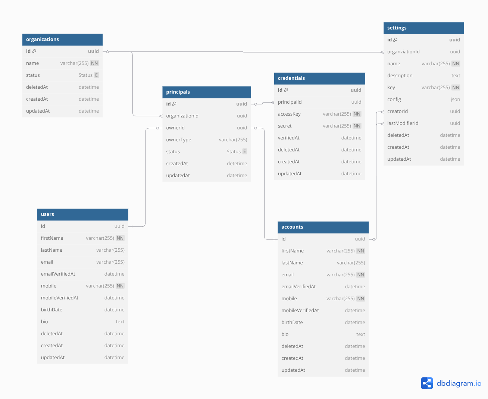

# Ordexa API

Ordexa is a modern, scalable API-first platform designed to streamline cross-border order management.

## Prerequisites

- Node.js (v22+)
- PostgreSQL
- npm or yarn

## Installation

1. Clone the repository:
   ```bash
   git clone https://github.com/yourusername/ordexa-api.git
   cd ordexa-api
   ```

2. Install dependencies:
   ```bash
   npm install
   # or
   yarn install
   ```

3. Create environment configuration:
   ```bash
   cp .env.example .env
   ```

## Configuration

### Using Configuration

```typescript
import config from '@config/config-loader';

// Get a string value
const appName = config.get<string>('app.name');

// Get a number with default
const port = config.get<number>('server.port', 3000);

// Get the entire config
const allConfig = config.getAll();
```

### Configuration Structure

The application uses a hierarchical configuration system with environment-specific overrides:

- `config/base.toml` - Base configuration for all environments
- `config/[environment].toml` - Environment-specific configurations
- `config/[environment].local.toml` - Local overrides (not committed)

## Database Setup

### DB Diagram
#### Credentials Diagram


### DB Migration
1. Ensure PostgreSQL is running
2. Update database connection details in your environment configuration
3. Run database migrations:
   ```bash
   npm run db:migrate
   # or
   yarn db:migrate
   ```

## Running the Application

### Development Mode

```bash
npm run dev
# or
yarn dev
```

The server will start with hot-reloading enabled.

### Production Mode

```bash
# Build the application
npm run build
# or
yarn build

# Start the production server
npm start
# or
yarn start
```

## Project Structure

```
ordexa-api/
├── config/               # Configuration files
├── src/
│   ├── core/             # Contain the application core
│   ├── controllers/      # Request handlers
│   ├── middlewares/      # Express middlewares
│   ├── models/           # Database models
│   ├── routes/           # API routes
│   ├── services/         # Business logic
│   ├── utils/            # Utility functions
│   └── bootstrap.ts      # Application entry point
├── tests/                # Test files
├── .env                  # Environment variables
└── README.md             # Explain the code structure, builder, and run the application
```

## API Documentation (Does not available at this time)

API documentation is available at `/api/docs` when the server is running.

## License

[MIT](LICENSE)
